# CosTheta — Automated Hub Assembly Inspection System

> A real-time, computer-vision-driven quality control platform for automotive steering knuckle and hub assembly lines, developed by **CosTheta Technologies**.

---

## Table of Contents

- [Overview](#overview)
- [Key Capabilities](#key-capabilities)
- [System Architecture](#system-architecture)
- [Process Architecture — Six Parallel Processes](#process-architecture--six-parallel-processes)
- [Inter-Process Communication — Redis Message Bus](#inter-process-communication--redis-message-bus)
- [Inspection Pipeline & State Machine](#inspection-pipeline--state-machine)
- [Camera Vision Pipeline](#camera-vision-pipeline)
- [AI Model Architecture](#ai-model-architecture)
- [PLC Integration & Tag Protocol](#plc-integration--tag-protocol)
- [Database Schema](#database-schema)
- [Heartbeat & Fault Monitoring](#heartbeat--fault-monitoring)
- [Configuration System](#configuration-system)
- [Logging Architecture](#logging-architecture)
- [Technology Stack](#technology-stack)
- [Deployment](#deployment)
- [Directory Structure](#directory-structure)

---

## Overview

The CosTheta Inspection System automates quality control at each station of a hub-assembly line. A **QR code** on every incoming component uniquely identifies the part (model, LHS/RHS, tonnage); the system then orchestrates a sequence of **camera-based visual inspections**, **PLC-interlocked torque checks**, and **press operations** before generating a pass/fail result that is written back to the PLC and persisted in PostgreSQL.

The platform runs as **six independent OS processes** connected through a **Redis message bus**, with a **PyQt6 GUI frontend** giving operators real-time status, image previews, and audit trails.

---

## Key Capabilities

| Capability | Detail |
|---|---|
| Visual inspection | Knuckle, Hub & Bottom Bearing, Top Bearing, Nut & Plate Washer, Split Pin & Washer, Cap, Bunk presence/absence |
| Component identification | QR code scanning via RS-232 serial scanner |
| PLC interlocking | EtherNet/IP (Allen-Bradley ControlLogix via `pycomm3`) — bidirectional tag read/write |
| AI models | MobileSAMv2 (segmentation) + YOLO (detection), shared singleton across inspection modules to minimise GPU footprint |
| Database | PostgreSQL — inspection records, torque values, machine settings, audit log |
| Alarm system | Audio alarms + configurable alarm thresholds; per-server heartbeat monitoring |
| Deployment | Nuitka-compiled standalone Windows executable; also runs natively on Linux |
| Modes | `PRODUCTION`, `TRIAL` (saves all images), `TEST` (mock PLC) |

---

## System Architecture

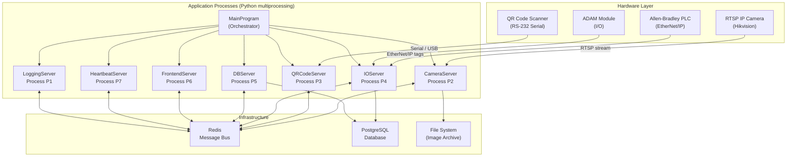

---

## Process Architecture — Six Parallel Processes

```mermaid
graph LR
    subgraph P1["P1 · LoggingServer"]
        L1["SlaveConsoleLogger"]
        L2["SlaveFileLogger"]
        L3["SlaveFrontendLogger"]
    end

    subgraph P2["P2 · CameraServer"]
        C1["MonitorGetPicQueue<br/>(Thread)"]
        C2["CameraProcessorServer<br/>(Thread)"]
        C3["CheckKnuckle"]
        C4["CheckTopBearing"]
        C5["CheckHubAndBottomBearing"]
        C6["CheckNutAndPlateWasher"]
        C7["CheckBunk / CheckNoBunk"]
        C8["CheckCap / CheckSplitPin"]
    end

    subgraph P3["P3 · QRCodeServer"]
        Q1["MonitorGetQRCodeQueue<br/>(Thread)"]
        Q2["QRCodeProcessor<br/>(Thread)"]
    end

    subgraph P4["P4 · IOServer"]
        I1["ReadLoop Thread"]
        I2["WriteTagsLoop Thread"]
        I3["HeartbeatThread"]
        I4["EmergencyMonitorThread"]
        I5["UpdateTagsToDefaultProcessor"]
    end

    subgraph P5["P5 · DBServer"]
        D1["InspectionRecord Writer"]
        D2["PostgresBackupUtility"]
    end

    subgraph P6["P6 · FrontendServer"]
        F1["AshokLeylandFrontEnd<br/>(PyQt6 GUI)"]
        F2["ImageProcessingGUI"]
        F3["SimplePopups"]
    end

    P2 -- "inspection result" --> P4
    P3 -- "QR code" --> P4
    P4 -- "trigger" --> P2
    P4 -- "record" --> P5
    P4 -- "status" --> P6
    P1 -- "log stream" --> P6
```

---

## Inter-Process Communication — Redis Message Bus

All processes communicate exclusively through named Redis queues (lists). No process calls another process's functions directly.

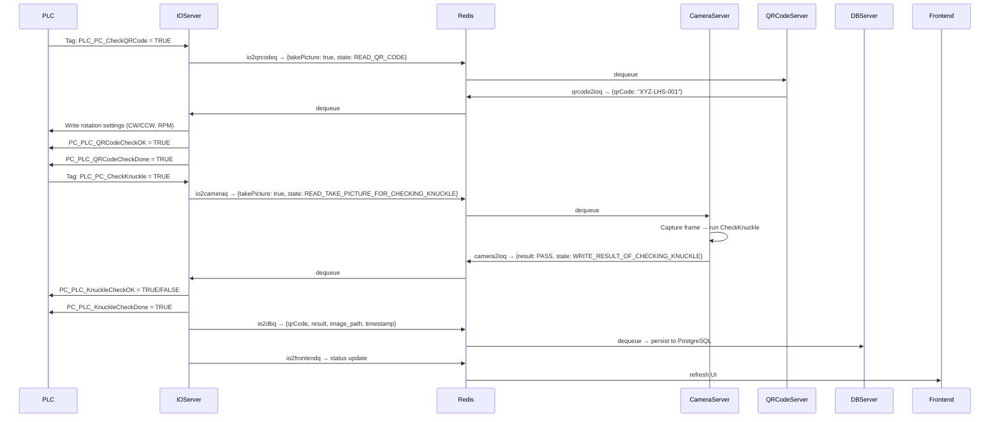

### Named Redis Queues

| Queue | Direction | Payload |
|---|---|---|
| `io2cameraq` | IOServer → CameraServer | `{takePicture, currentMachineState, timestamp}` |
| `camera2ioq` | CameraServer → IOServer | `{result, state, imagePath, timestamp}` |
| `io2qrcodeq` | IOServer → QRCodeServer | `{takePicture, state}` |
| `qrcode2ioq` | QRCodeServer → IOServer | `{qrCode}` |
| `io2dbq` | IOServer → DBServer | Inspection record payload |
| `io2frontendq` | IOServer → Frontend | Status / result for display |
| `logq` | All → LoggingServer | Log messages |
| `heartbeatq` | All → HeartbeatServer | Liveness pings |
| `stopq` | MainProgram → All | Graceful shutdown signal |

---

## Inspection Pipeline & State Machine

The assembly process is modelled as a 29-state `IntEnum` (`MachineState`). States alternate between **READ** states (waiting for PLC trigger) and **WRITE** states (writing result back to PLC).

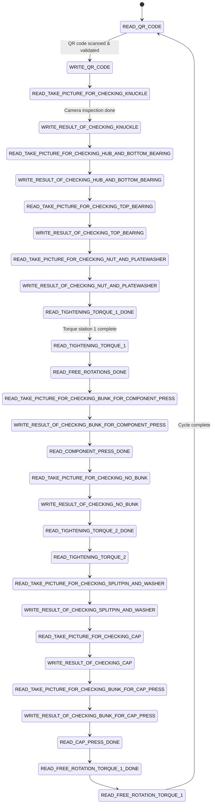

### Cycle Time Tracking

The IOServer tracks wall-clock durations for each operation segment, ignoring operator idle time, and logs cycle time analytics:

| Operation Key | Segment |
|---|---|
| `T1_Knuckle` | PLC trigger → knuckle check result written |
| `T2_HubAndBottomBearing` | PLC trigger → hub/bearing result written |
| `T3_TopBearing` | PLC trigger → top bearing result written |
| `T4_NutAndPlateWasher_to_FreeRotations` | Nut/washer check through free rotations |
| `T5_NoCapBunk` | Bunk check (no-cap) |
| `T6_NoCapBunkStart_to_Torque2Done` | Torque 2 segment |
| `T7_SplitPinAndWasher` | Split pin & washer check |
| `T8_Cap` | Cap check |
| `T9_BunkCapPress_to_Station3TorqueValueSet` | Cap press through final torque |

---

## Camera Vision Pipeline

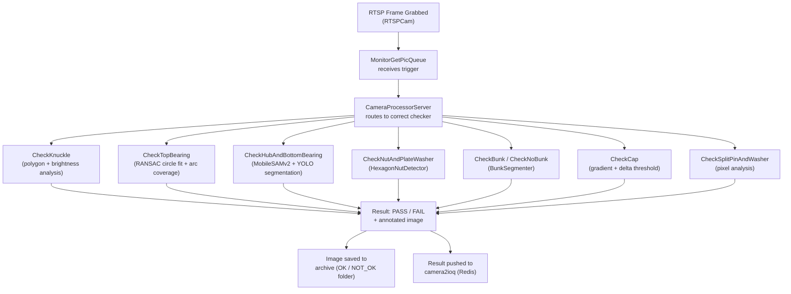

### Per-Component Inspection Techniques

| Component | Primary Technique |
|---|---|
| **Knuckle** | Polygon-region brightness & contrast analysis |
| **Top Bearing** | RANSAC circle fitting, arc coverage scoring, gamma normalisation |
| **Hub & Bottom Bearing** | MobileSAMv2 automatic mask generation + YOLO object detection |
| **Nut & Plate Washer** | HexagonNutDetector — geometric contour + orientation analysis |
| **Bunk (presence)** | BunkSegmenter — SAM-based segmentation |
| **No Bunk (absence)** | Negative-space verification |
| **Cap** | Gradient-based delta threshold per model variant |
| **Split Pin & Washer** | Pixel-level presence check in ROI |

### Image Normalisation

Before inference, frames pass through `ImageNormalisationWithMask`, which applies:

- Gamma correction via precomputed LUT
- Per-channel normalisation within a configurable mask region
- Crop to annotated region of interest

---

## AI Model Architecture

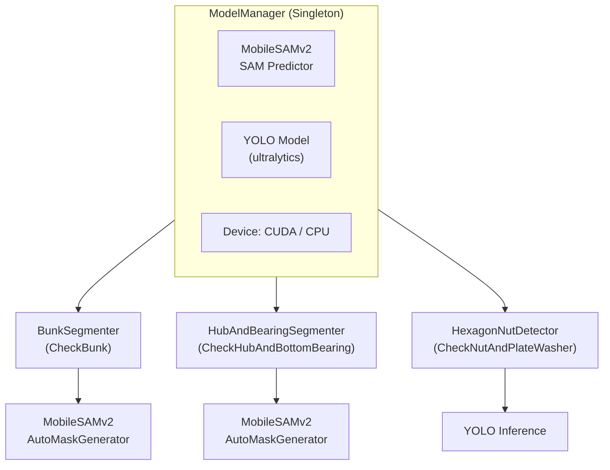

`ModelManager` is a thread-safe singleton that loads MobileSAMv2 and YOLO **once** and shares the same model objects across all inspection modules. This reduces GPU memory consumption from ~9–12 GB (three independent model sets) to **~3–4 GB**.

---

## PLC Integration & Tag Protocol

Communication with the Allen-Bradley PLC uses **EtherNet/IP** via the `pycomm3` `LogixDriver`. The IOServer maintains two driver instances: one dedicated to reads, one to writes.

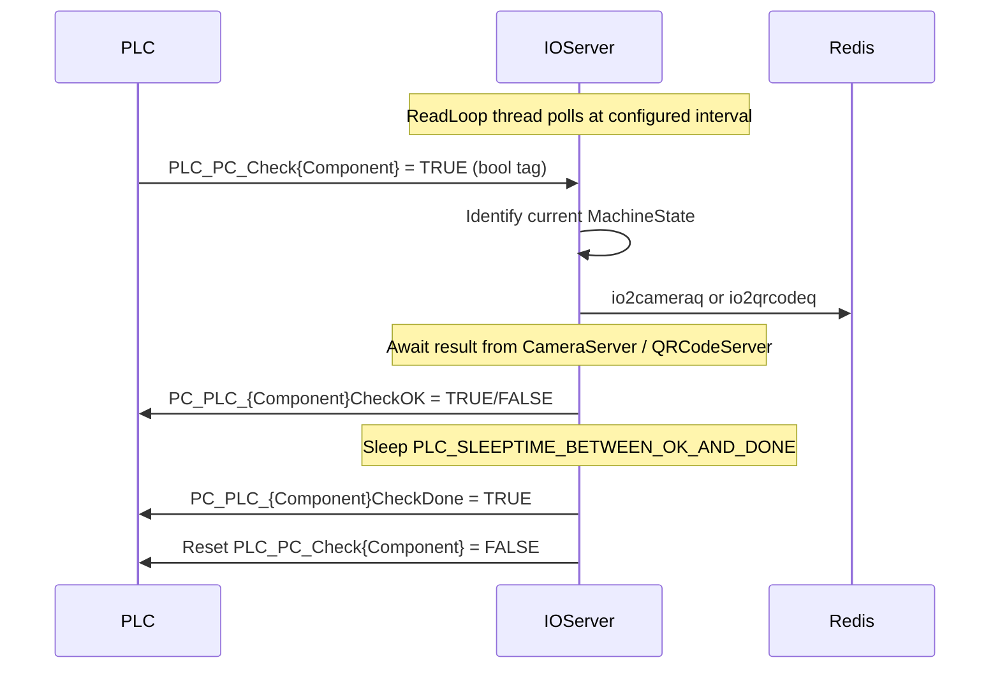

### PLC Tag Map (representative subset)

| Direction | Tag | Type | Purpose |
|---|---|---|---|
| PLC → PC | `PLC_PC_CheckQRCode` | bool | Request QR scan |
| PLC → PC | `PLC_PC_CheckKnuckle` | bool | Request knuckle inspection |
| PLC → PC | `PLC_PC_CheckHub` | bool | Request hub inspection |
| PLC → PC | `PLC_PC_CheckTopBearing` | bool | Request top bearing inspection |
| PLC → PC | `PLC_PC_CheckNutAndPlateWasher` | bool | Request nut/washer inspection |
| PLC → PC | `PLC_PC_TighteningTorque1Done` | bool | Torque station 1 complete |
| PC → PLC | `PC_PLC_QRCodeCheckOK` | bool | QR code result |
| PC → PLC | `PC_PLC_KnuckleCheckOK` | bool | Knuckle result |
| PC → PLC | `PC_PLC_HubCheckOK` | bool | Hub result |
| PC → PLC | `PC_PLC_NoOfRotation1CW` | int | Rotation count (LHS) |
| PC → PLC | `PC_PLC_NoOfRotation1CCW` | int | Rotation count (RHS) |
| PC → PLC | `PC_PLC_LH_RH_Selection` | int | 1 = LHS, 2 = RHS |
| PC → PLC | `PC_PLC_RotationUnitRPM` | int | Rotation speed |

---

## Database Schema

The system uses **PostgreSQL** (local, port 5432). The IOServer maintains a `ThreadedConnectionPool` (min 1, max 3 connections).

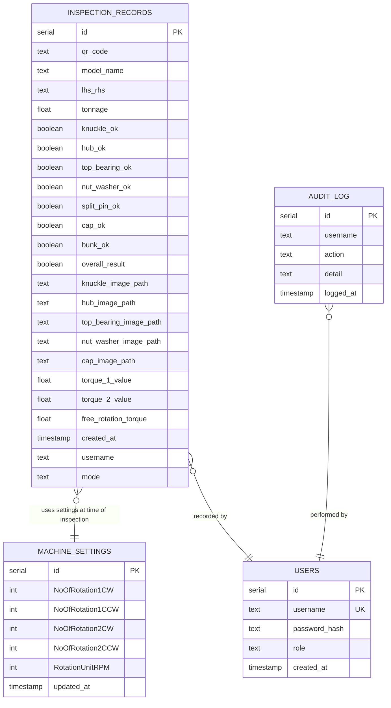

---

## Heartbeat & Fault Monitoring

`HeartbeatAndAlarmServer` runs as a dedicated thread that monitors all five peer servers. Each server publishes a liveness signal to Redis at a configurable interval. If a server misses a threshold number of consecutive heartbeats, the alarm system fires.

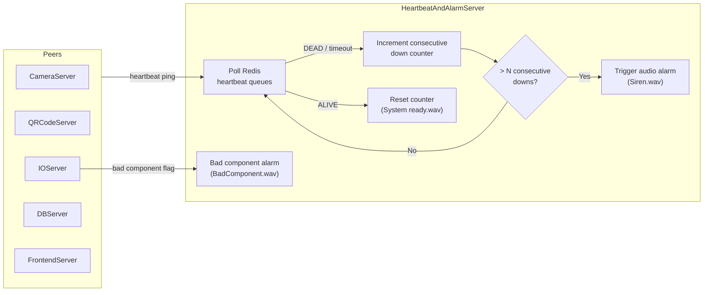

Connection status is relayed to the frontend in real time, allowing operators to see at a glance which servers are up.

---

## Configuration System

All runtime parameters are externalised to `ApplicationConfiguration.properties`. The `CosThetaConfigurator` class is a **thread-safe double-checked locking singleton** that hot-reloads the properties file every 5 seconds if a change is detected — no restart required.

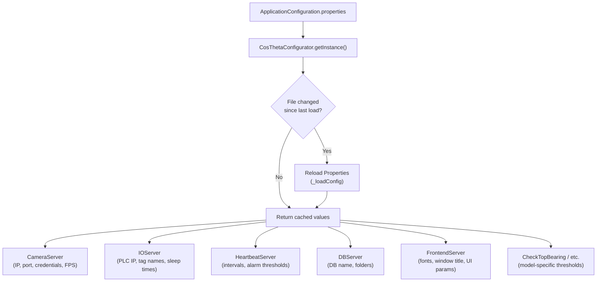

Key configuration categories:

| Category | Example Keys |
|---|---|
| Camera | `camera.ip`, `camera.port`, `camera.uid`, `camera.fps` |
| PLC | `plc.ip`, `plc.pc.check.knuckle.tagname`, `pc.plc.knuckle.check.ok.tagname` |
| Heartbeat | `heartbeat.minimum.continuous.disconnections.for.alarm`, `heartbeat.gap.between.alarms` |
| Image paths | `images.base.folder`, `images.knuckle.folder`, `images.ok.folder` |
| Logging | `logging.directory`, `logging.file.level`, `logging.console.level` |
| UI | `application.name`, `font.face`, `initial.fontsize` |

---

## Logging Architecture

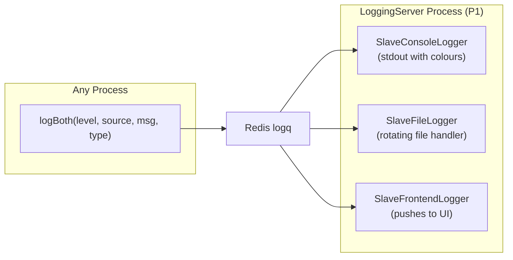

All processes call the single `logBoth()` helper, which pushes a message onto the Redis log queue. The dedicated `LoggingServer` process drains this queue and fans messages out to three sinks: colour-coded console, rotating file, and the frontend log panel.

Log levels follow Python's standard hierarchy (`DEBUG`, `INFO`, `WARNING`, `ERROR`, `CRITICAL`) with a custom `MessageType` enum (`SUCCESS`, `ISSUE`, `PROBLEM`, `RISK`, `GENERAL`) that drives colour coding.

---

## Technology Stack

| Layer | Technology |
|---|---|
| Language | Python 3.10+ |
| GUI | PyQt6 / PySide6 |
| Computer vision | OpenCV, NumPy |
| AI / Segmentation | MobileSAMv2, YOLO (ultralytics), PyTorch |
| PLC communication | pycomm3 (EtherNet/IP) |
| Message bus | Redis |
| Database | PostgreSQL + psycopg2 |
| QR scanning | pyserial (RS-232) |
| Configuration | pyjavaproperties |
| Compilation | Nuitka (standalone Windows exe) |
| Concurrency | Python `multiprocessing` (processes) + `threading` (intra-process threads) |

---

## Deployment

### Requirements

- Python 3.10 or 3.11
- Redis server (local or network)
- PostgreSQL 14+
- CUDA-capable GPU (recommended for SAM inference)
- Camera accessible via RTSP
- Allen-Bradley PLC on same LAN

### Running from source

```bash
# 1. Install dependencies
pip install -r requirements.txt

# 2. Configure the application
cp ApplicationConfiguration.properties.template ApplicationConfiguration.properties
# Edit the file with your camera IP, PLC IP, DB name, etc.

# 3. Start Redis
redis-server

# 4. Create the PostgreSQL database
createdb <your_db_name>

# 5. Launch
python MainProgram.py
```

### Building a standalone Windows executable

```bat
runNuitka.bat
```

The compiled binary and all dependencies are placed in `MainProgram.dist/`. Copy the `wavs/` and `internalimages/` directories alongside it before distributing.

### Modes

| Mode | Behaviour |
|---|---|
| `PRODUCTION` | Normal operation; only failed-inspection images are saved |
| `TRIAL` | All images saved regardless of result; useful for model tuning |
| `TEST` | Uses a mock PLC driver; camera and Redis required |

---

## Directory Structure

```
.
├── MainProgram.py                  # Entry point — spawns all processes
├── Configuration.py                # Singleton configuration manager
├── StateMachine.py                 # MachineState enum + MachineStateMachine
├── BaseUtils.py                    # Project root resolution, time utils, profiling
├── Constants.py                    # Application-wide string constants
├── ApplicationConfiguration.properties  # Runtime configuration (not committed)
│
├── camera/                         # All camera and vision logic
│   ├── CameraProcessorServer.py
│   ├── RTSPCam.py
│   ├── ModelManager.py             # Singleton GPU model loader
│   ├── CheckKnuckle.py
│   ├── CheckTopBearing.py
│   ├── CheckHubAndBottomBearing.py
│   ├── CheckNutAndPlateWasher.py
│   ├── CheckBunk.py / CheckNoBunk.py
│   ├── CheckCap.py / CheckNoCapBunk.py
│   ├── CheckSplitPinAndWasher.py
│   ├── BunkSegmenter.py
│   ├── HubAndBearingSegmenter.py
│   └── HexagonNutDetector.py
│
├── costhetaio/                     # Hardware I/O
│   ├── IOServer.py                 # PLC (EtherNet/IP) + DB connection pool
│   └── QRCodeScanningServer.py
│
├── persistence/                    # Database access
│   ├── DBServer.py
│   ├── Persistence.py
│   └── PostgresBackupUtility.py
│
├── frontend/                       # PyQt6 GUI
│   ├── AshokLeylandFrontEnd.py
│   ├── ImageProcessingGUI.py
│   └── SimplePopups.py
│
├── logutils/                       # Distributed logging
│   ├── Logger.py
│   ├── CentralLoggers.py
│   ├── AbstractSlaveLogger.py
│   └── SlaveLoggers.py
│
├── monitorAllConnections/          # Heartbeat & alarm
│   └── HeartbeatAndAlarmServer.py
│
├── processors/                     # Thread base classes
│   └── GenericQueueProcessor.py
│
├── utils/                          # Shared utilities
│   ├── RedisUtils.py               # All queue read/write helpers
│   ├── BaseUtils.py
│   ├── CosThetaFileUtils.py
│   ├── CosThetaImageUtils.py
│   ├── CosThetaColors.py
│   ├── IPUtils.py
│   └── QRCodeHelper.py
│
├── wavs/                           # Audio alarm files
│   ├── Siren.wav
│   ├── BadComponent.wav
│   └── System is ready.wav
│
└── runNuitka.bat                   # Windows standalone build script
```

---

*Developed by CosTheta Technologies. For integration support, contact the manufacturer.*